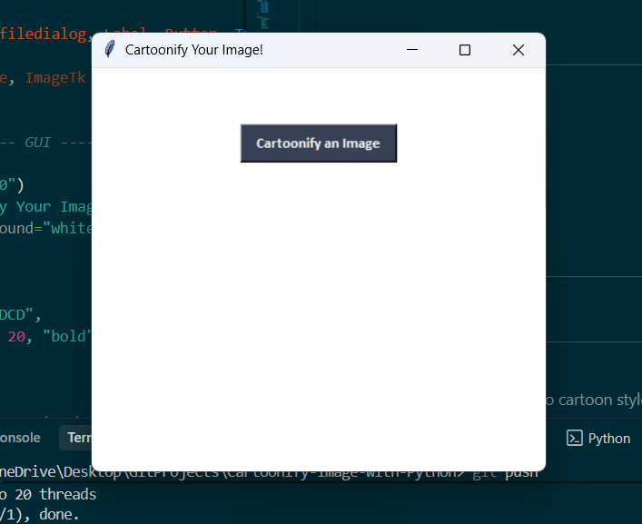
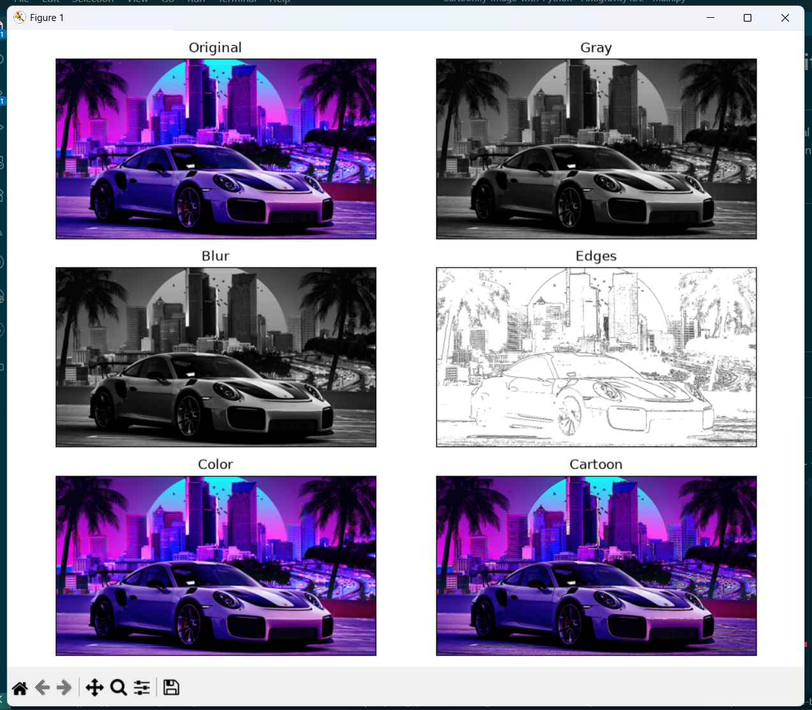
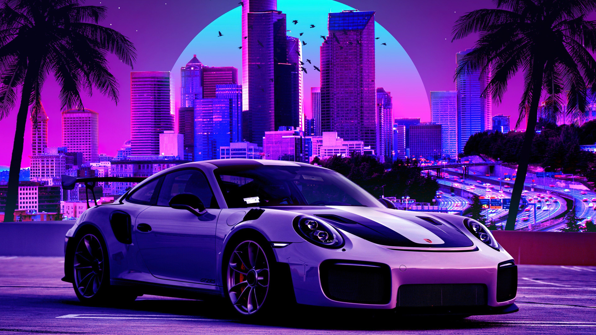

# 🎨 Cartoonify Image with Python

A simple Python application that converts normal images into cartoon-style images using OpenCV and Tkinter.

## 📸 Preview

### Home Screen



### Output



---

## ✨ Features

- Upload an image
- Convert image into cartoon style
- View processing steps
- Save the cartoonified image
- Simple Tkinter GUI

---

## 🛠️ Technologies Used

- Python
- OpenCV
- Tkinter
- NumPy
- Matplotlib
- Pillow

---

## 📂 Project Structure

```
Cartoonify-Image-with-Python/
│── assets/
│── cartoonify.py
│── README.md
```

---

## 🚀 Installation

```bash
pip install opencv-python numpy matplotlib pillow imageio
```

---

## ▶️ Run

```bash
python cartoonify.py
```

---

## 📷 Sample Result

| Original | Cartoon |
|----------|----------|
|  |  |

---

## 📜 License

This project is for learning and educational purposes.